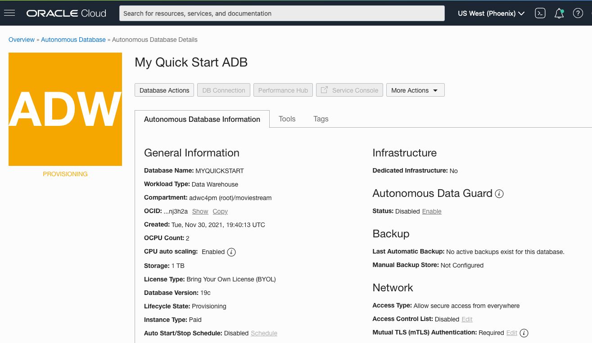

# Provision an Autonomous Database

## Introduction

Deploy a complete data warehousing platform that scales to both your technical and analytic requirements.

Estimated Time: 5 minutes

### Objectives

In this lab, you will:

-   Provision a new Autonomous Database

### Prerequisites

-   This lab requires completion of the Get Started section in the Contents menu on the left.

## Task 1: Choose Autonomous Database from the Services Menu
</if>
<if type="livelabs">
## Task 1: Choose Autonomous Database from the Services Menu
</if>

1. Log in to the Oracle Cloud Interface.
2. Once you log in, you arrive at the cloud services dashboard where you can see all the services available to you. Click the navigation menu in the upper left to show top level navigation choices and then click **Autonomous Database**.

    

## Task 2: Create the Autonomous Database instance

1. Click **Create Autonomous Database** to start the instance creation process.

    

2.  This brings up the __Create Autonomous Database__ screen where you will specify the configuration of the instance.

<if type="freetier">
    
</if>
<if type="livelabs">
    
</if>

3. Give basic information for the autonomous database:

<if type="freetier">
    - __Choose a compartment__ - You can simply use the default compartment or pick a different one. See [the documentation](https://docs.oracle.com/en-us/iaas/Content/Identity/Tasks/managingcompartments.htm) if you want to learn more about compartments.
    - __Display Name__ - Enter a memorable name for the database for display purposes. For this lab, use __My Quick Start ADB__.
    - __Database Name__ - Use letters and numbers only, starting with a letter. Maximum length is 14 characters. (Underscores not initially supported.) For this lab, use __MYQUICKSTART__.

    
</if>
<if type="livelabs">
    - __Choose a compartment__ - Use the default compartment created for you.
    - __Display Name__ - Enter a memorable name for the database for display purposes. For this lab, use __My Quick Start ADB__.
    - __Database Name__ - Use letters and numbers only, starting with a letter. Maximum length is 14 characters. (Underscores not initially supported.) For this lab, use __MOVIE+your user id__, for example, __MOVIE9352__.

    
</if>

4. Choose __Data Warehouse__ workload type: 

    

5. Choose __Shared Infrastructure__ deployment type:

    

6. Configure the database:

    - __Always Free__ - If your Cloud Account is an Always Free account, you can select this option to create an always free autonomous database. An always free database comes with 1 CPU and 20 GB of storage. For this lab, we recommend you leave Always Free unchecked.
    - __Choose database version__ - Select 19c as the database version.
    - __OCPU count__ - Number of CPUs for your service. For this lab, specify __2 CPUs__. If you choose an Always Free database, it comes with 1 CPU.
    - __Storage (TB)__ - Select your storage capacity in terabytes. For this lab, specify __1 TB__ of storage. Or, if you choose an Always Free database, it comes with 20 GB of storage.
    - __Auto Scaling__ - For this lab, keep auto scaling enabled, to enable the system to automatically use up to three times more CPU and IO resources to meet workload demand.
    - __New Database Preview__ - If a checkbox is available to preview a new database version, do NOT select it.

    > **Note:** You cannot scale up/down an Always Free autonomous database.

    

7. Create administrator credentials:

    - __Password and Confirm Password__ - Specify the password for ADMIN user of the service instance. The password must meet the following requirements:
    - The password must be between 12 and 30 characters long and must include at least one uppercase letter, one lowercase letter, and one numeric character.
    - The password cannot contain the username.
    - The password cannot contain the double quote (") character.
    - The password must be different from the last 4 passwords used.
    - The password must not be the same password that you set less than 24 hours ago.
    - Re-enter the password to confirm it. Make a note of this password.

    

8. Choose network access:
    - For this lab, accept the default, "Secure access from everywhere."
    - If you want a private endpoint, to allow traffic only from the VCN you specify - where access to the database from all public IPs or VCNs is blocked, then select "Virtual cloud network" in the Choose network access area.
    - You can control and restrict access to your Autonomous Database by setting network access control lists (ACLs). You can select from 4 IP notation types: IP Address, CIDR Block, Virtual Cloud Network, Virtual Cloud Network OCID).

    

9. Choose a license type. <if type="freetier">For this lab, choose __License Included__.</if><if type="livelabs">For this lab, choose __Bring Your Own License (BYOL)__.</if> The two license types are:
    - __Bring Your Own License (BYOL)__ - Select this type when your organization has existing database licenses.
    - __License Included__ - Select this type when you want to subscribe to new database software licenses and the database cloud service.

<if type="freetier">
    
</if>
<if type="livelabs">
    
</if>

10. Click __Create Autonomous Database__.

11.  Your instance will begin provisioning. In a few minutes, the state will turn from Provisioning to Available. At this point, your Autonomous Database is ready to use! Have a look at your instance's details here including its name, database version, OCPU count, and storage size.

    
    Provisioning an Autonomous Database instance.

    
    Autonomous Database sucessfully provisioned.

Please *proceed to the next lab*.

## Learn more

See the [documentation](https://docs.oracle.com/en/cloud/paas/autonomous-data-warehouse-cloud/user/autonomous-workflow.html#GUID-5780368D-6D40-475C-8DEB-DBA14BA675C3) on the typical workflow for using Autonomous Data Warehouse.

## Acknowledgements

- **Author** - Nilay Panchal, Oracle Autonomous Database Product Management
- **Adapted for Cloud by** - Richard Green, Principal Developer, Database User Assistance
- **Last Updated By/Date** - Marty Gubar, November 2021
